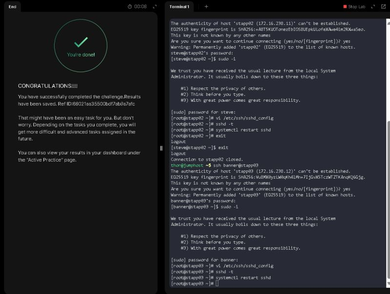

# Day 02 — Temporary User Setup with Expiry

## 🎯 Task
Create a **temporary user** with an expiry date to ensure secure and time-bound access.

---

## 🧭 Step-by-Step Implementation

### 1. Connect to the Target Server
Log in to App Server 3 (`stapp03`):
```bash
ssh banner@stapp03
```
*(Replace `banner` with your login username if different.)*

### 2. Verify Existing Users (Optional)
Check if the user already exists:
```bash
getent passwd mariyam
```
If no output is returned, the user does not exist yet.

### 3. Create the Temporary User with Expiry
Use the `useradd` command with the `-e` flag to set an expiry date:
```bash
sudo useradd -e 2024-04-15 mariyam
```
- `-e 2024-04-15`: expiry date in `YYYY-MM-DD` format
- `mariyam`: the username being created

### 4. Set a Password for the User
```bash
sudo passwd mariyam
```
You’ll be prompted to enter and confirm a password.

### 5. Verify the Account Expiry
Check the expiry date assigned to the user:
```bash
sudo chage -l mariyam
```
**Example output:**
```
Last password change                                    : Sep 22, 2025
Password expires                                        : never
Password inactive                                       : never
Account expires                                         : Apr 15, 2024
Minimum number of days between password change          : 0
Maximum number of days between password change          : 99999
Number of days of warning before password expires       : 7
```
This confirms the expiry is correctly applied.

### 6. Validate Login Behavior
- **Before expiry:** The user can log in normally.
- **After 2024-04-15:** Login attempts will fail with a message like:
  > Your account has expired; please contact your system administrator.

### 7. (Optional) Cleanup After Expiry
Remove the user completely after the project ends:
```bash
sudo userdel -r mariyam
```
- `-r` ensures the home directory and mail spool are also removed.

---

## ✅ Final Results
- Created user: `mariyam`
- Set expiry date: `2024-04-15`
- Verified via `chage -l mariyam`
- Ensured provisioning was done on App Server 3 (`stapp03`)

---

## 💡 Reflection
This exercise highlights how temporary accounts can be provisioned securely. By setting expiry dates, we reduce the risk of stale accounts lingering in production, which strengthens overall access control and compliance posture.

---

## 📸 Screenshots



