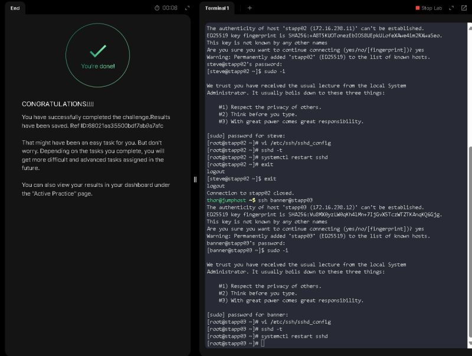

# 🛡️ Day 3 of 100 Days of DevOps

## 🔐 Objective
Disable direct **root SSH login** on all application servers in the **Stratos Datacenter** to comply with strict security audit protocols.

---

## 📂 Steps Performed

### 1. Access the Application Servers
- Connect to the **jump host** securely.
- From the jump host, log in to each of the **3 application servers**:
```bash
ssh user@jump_host
ssh app01
ssh app02
ssh app03
```

### 2. Switch to Root User
Since direct root login is not recommended, switch to root using sudo:
```bash
sudo -i
```

### 3. Edit the SSH Configuration File
Open the SSH daemon configuration file:
```bash
vi /etc/ssh/sshd_config
```
Locate the line containing `PermitRootLogin` and change its value to `no`:
```conf
PermitRootLogin no
```
Save and exit the file.

### 4. Validate the SSH Configuration
Test the SSH configuration syntax before restarting the service:
```bash
sshd -t
```
If no output is shown, the configuration is valid.

### 5. Restart the SSH Service
Apply the changes by restarting the SSH daemon:
```bash
systemctl restart sshd
```

### 6. Verification
Try to log in as root over SSH:
```bash
ssh root@app01
```
You should see "Permission denied", confirming that root login via SSH is disabled.

---

## ✅ Result
Root access over SSH is now completely disabled on all application servers in the Stratos Datacenter, enhancing overall system security.

---

## 📌 Key Notes
- Disabling root login minimizes the attack surface.
- System administrators should use non-root accounts with sudo privileges for better auditing and control.
- Always validate configuration before restarting services to avoid accidental lockouts.

---

## 📸 Screenshots



